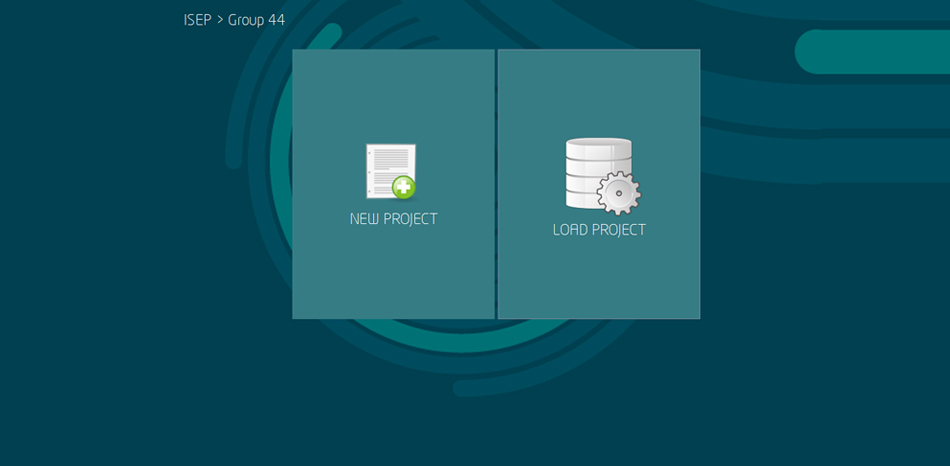
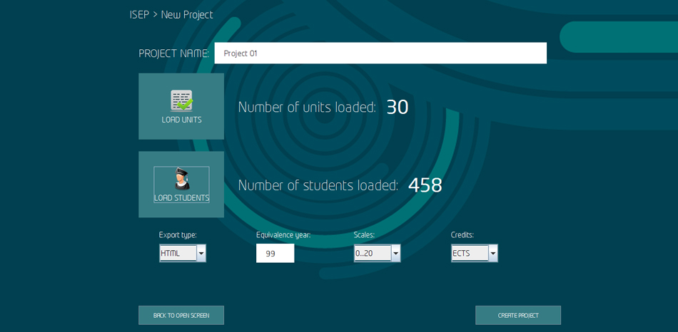
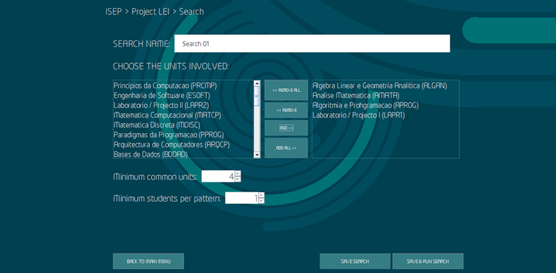

 

  
  <h3 align="center">lapr2g44</h3>

  

    Check for student grade patterns on units.
  

  
  

### Prerequisites

This is an example project made in Java.

* Java

### Screens

  
  <h3 align="center">Project creation page</h3>
   
  
   
   
  <h3 align="center">Pattern match configuration page</h3>
   
  

